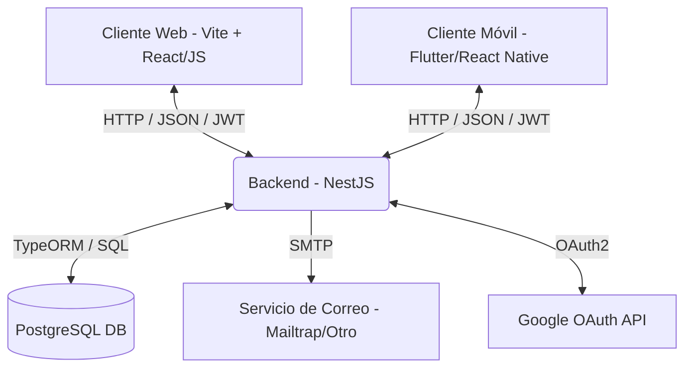
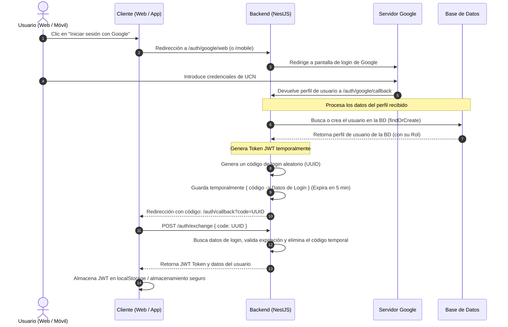
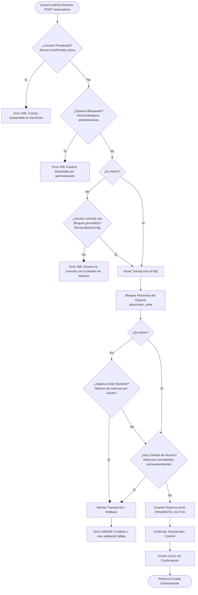
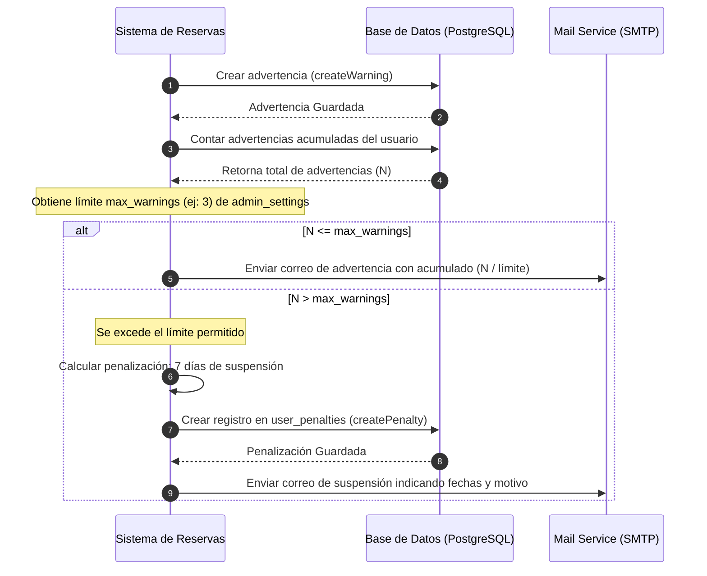

# Flujos y Funcionamiento del Sistema de Reservas UCN

Este documento describe la arquitectura, los flujos principales de datos y las reglas de negocio del sistema de reservas de salas y mesas de estudio.

---

## 1. Arquitectura General y Tecnologías

El sistema se compone de tres piezas principales que se comunican entre sí:

- **Backend (NestJS + TypeORM)**: Expone una API REST, maneja la lógica de negocio, validación de colisiones de horarios con bloqueo pesimista y se conecta a la base de datos PostgreSQL.
- **Frontend Web & App Móvil**: Consumen la API REST enviando un token JWT en la cabecera `Authorization: Bearer <TOKEN>` para todas las rutas protegidas.
- **PostgreSQL**: Motor de base de datos relacional.
- **Google OAuth**: Proveedor de identidad externo para la autenticación segura de los estudiantes e investigadores de la UCN.

---

## 2. Flujo de Autenticación (Google OAuth)

La autenticación no requiere contraseña local. Se utiliza la cuenta institucional de Google de la UCN. El backend actúa como puente OAuth y genera un código de un solo uso que luego se intercambia por el JWT final.

---

## 3. Flujo de Reservas y Validaciones

Cuando un usuario desea reservar un espacio (sala o mesa) en un día y bloque horario específico, el backend realiza una serie de validaciones secuenciales estrictas antes de confirmar la reserva en una transacción aislada.

### Reglas de Negocio en la Creación de Reservas
1. **Bloqueo Pesimista (`pessimistic_write`)**: Cuando se evalúan las colisiones, el backend bloquea la fila del espacio correspondiente. Si dos estudiantes intentan reservar la misma sala al mismo milisegundo, la segunda petición esperará a que termine la primera, evitando reservas duplicadas (double-booking).
2. **División de Bloques (`BlockConfig`)**: Permite subdividir los bloques de estudio (ej: Bloque A de 90 min en 2 subbloques de 45 min). El sistema valida que las horas ingresadas coincidan exactamente con el esquema vigente a la fecha de la reserva.
3. **Límite Semanal**: Los estudiantes regulares tienen un límite máximo de horas o cantidad de reservas semanales para garantizar equidad. Los administradores están exentos de esta restricción.

---

## 4. Flujo de Infracciones, Advertencias y Penalizaciones automáticas

Para evitar el ausentismo y promover el uso responsable de los recursos, el sistema cuenta con un mecanismo automático de advertencias (`UserWarning`) y suspensiones temporales (`UserPenalty`).

### Generación de Advertencias
Se crea una advertencia cuando un usuario:
- Cancela una reserva fuera del plazo permitido (ej: menos de 24 horas antes).
- No asiste a su reserva y no realiza la confirmación/check-in a tiempo.

### Flujo de Penalización Automática:

### Consecuencia de la Penalización
Durante el período de vigencia de la penalización (desde `startDate` hasta `endDate`), cualquier intento del usuario de crear una nueva reserva será rechazado automáticamente por la API con un error de validación de negocio.

---

## 5. Gestión del Administrador

El rol de **Administrador** (`admin`) posee privilegios exclusivos para gestionar el sistema a través de las siguientes funcionalidades de backend:
1. **Ajustes del Sistema (`AdminSetting`)**: Permite modificar claves-valor globales en caliente como `confirm_deadline_days`, `cancel_deadline_days` y `max_warnings`.
2. **Configuración de Bloques (`BlockConfig`)**: Cambiar la granularidad de los turnos de reserva (1, 2, 3 o 4 subdivisiones de los bloques base) a partir de una fecha específica.
3. **Bloqueo Administrativo de Espacios (`SpaceBlock`)**: Bloquear salas completas o turnos específicos para mantenimiento, eventos institucionales o feriados, cancelando o impidiendo reservas de estudiantes para ese rango.
